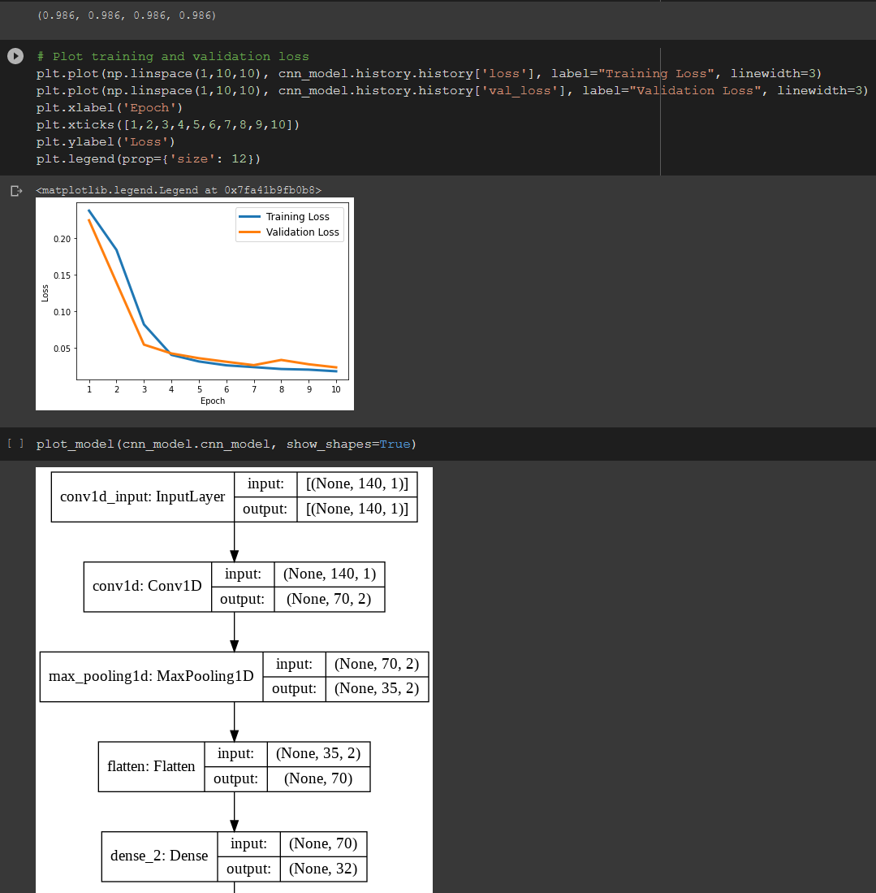
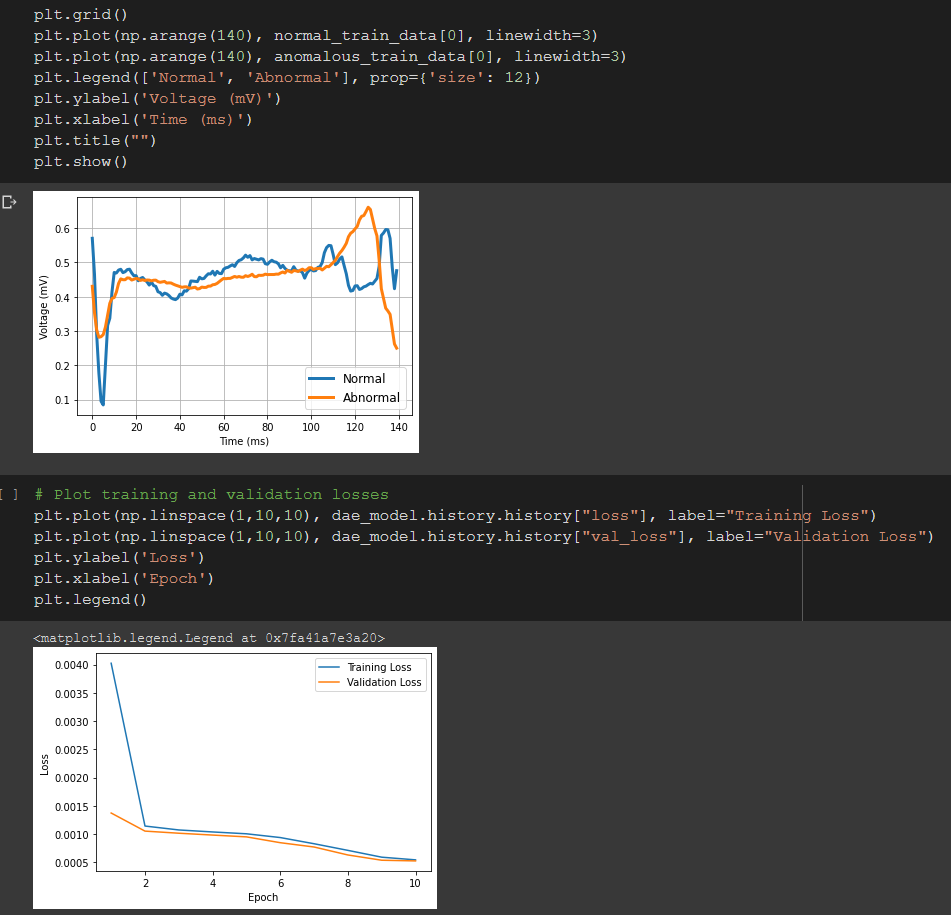
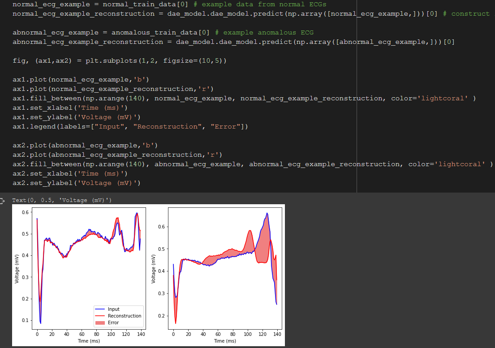
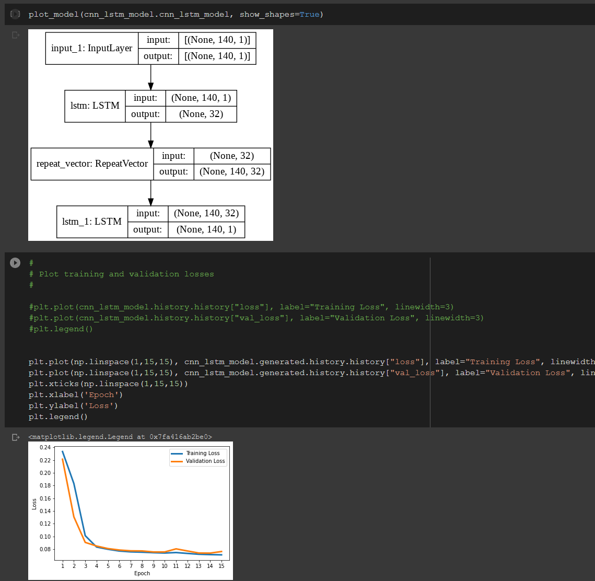
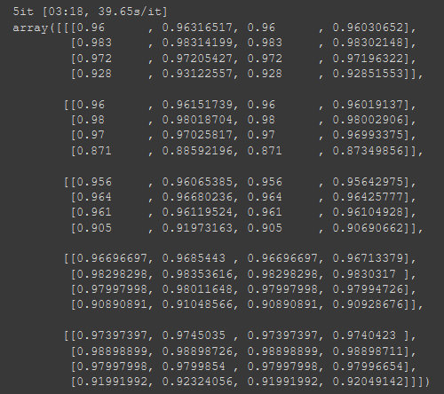
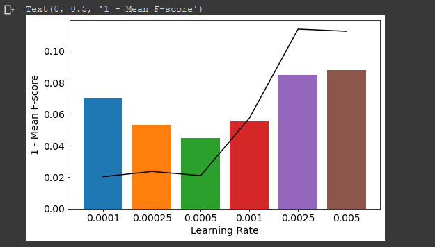

# SCC413 University Project
Classification of ECG samples using Deep Neural Networks

# Background

This code is part of a project within a University Deep Learning (DL) module.
We use the ECG5000 dataset, as well as the MIT-BIH dataset for comparing three DL classifiers, using a multi-layer perceptron as a baseline.

### Classifiers
+ Convolutional Neural Network - CNN
+ Deep Autoencoder for Anomaly Detection
+ LSTM Autoencoder with CNN classifier

### Python libraries used
+ Numpy
+ Pandas
+ TensorFlow/Keras
+ Scikit-learn
+ tqdm
+ timeit

# Screenshots

